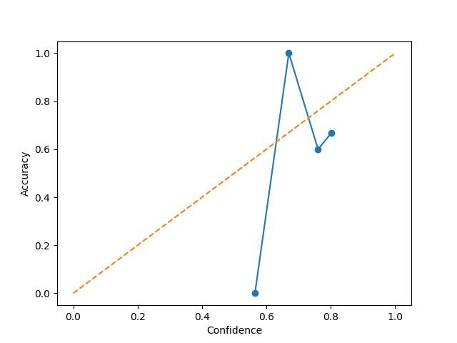
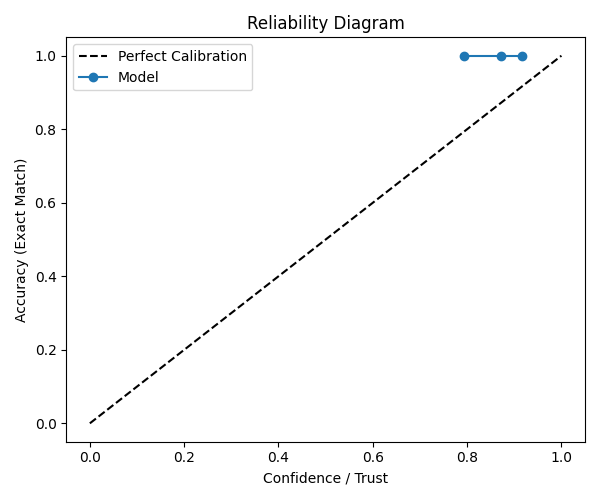

# WhiteBox-UQ-RAG

White-box uncertainty quantification for retrieval-augmented question answering systems using token-level log-probabilities, retrieval signals, calibration, and cross-model evaluation.

---

## Overview

Large Language Models can generate fluent answers even when incorrect.  
This project studies whether internal model confidence signals can reliably predict answer correctness in Retrieval-Augmented Generation (RAG) systems.

The core focus is **white-box uncertainty quantification**:

- Access model logits during generation
- Compute answer-level confidence
- Compare confidence against actual correctness
- Evaluate whether confidence generalizes across models and retrieval settings

---

## Motivation

Reliable AI systems require more than accuracy.

They also need to know:

- When they are likely correct
- When they are uncertain
- When they should abstain
- Whether confidence remains useful across model sizes

This repository investigates whether average token log-probability is a practical confidence signal for QA systems.

---

## Research Hypothesis

Average answer token log-probability (`avg_answer_logprob`) is a reliable predictor of answer correctness in retrieval-augmented QA systems.

If true:

- Higher confidence answers should be correct more often
- Lower confidence answers should fail more often
- Confidence ranking should improve selective answering
- Signal should generalize across model sizes

---

## Why SQuAD QA Was Chosen

SQuAD provides:

- Standard extractive QA benchmark
- High-quality human-labeled answers
- Clear EM / F1 evaluation
- Strong baseline for uncertainty experiments
- Repeatable comparison across models

This makes it suitable for controlled confidence evaluation.

---

## Experimental Pipeline

```text
SQuAD Corpus
   ↓
SentenceTransformer Embeddings
   ↓
FAISS Retrieval Index
   ↓
Top-k Retrieved Context
   ↓
LLM Answer Generation
   ↓
Token Log-Probability Extraction
   ↓
Confidence Scoring
   ↓
Correctness Evaluation (EM / F1)
   ↓
AUROC / Calibration / Risk-Coverage
````


## Models Evaluated

### RAG Conditions

* `mistralai/Mistral-7B-Instruct-v0.3`
* `Qwen/Qwen2.5-0.5B-Instruct`

### No-RAG Ablation

* `Qwen/Qwen2.5-0.5B-Instruct`





## Dataset

### Stanford Question Answering Dataset (SQuAD)

Used validation split with generated retrieval corpus from contexts.

Approximate project artifacts:

* Unique corpus passages: 2067
* Validation QA pairs: 10k+

---

## Metrics

### QA Quality

* Exact Match (EM)
* Token F1
* Accuracy using `F1 ≥ 0.8`

### Confidence Quality

* AUROC
* AUPRC
* Expected Calibration Error (ECE)
* Risk-Coverage Curve
* AURC

---

## Key Results

| Condition        | Mean F1 | Accuracy (F1≥0.8) | AUROC (logprob) |
| ---------------- | ------- | ----------------- | --------------- |
| Mistral-7B + RAG | 0.641   | 0.564             | 0.773           |
| Qwen-0.5B + RAG  | 0.423   | 0.360             | 0.747           |
| Qwen-0.5B no-RAG | 0.068   | 0.023             | 0.732           |

---

## Main Findings

### 1. Internal Confidence Is Predictive

Average token log-probability strongly predicts correctness.

### 2. Signal Generalizes Across Model Sizes

A 0.5B model retains similar uncertainty ranking behavior relative to a 7B model.

### 3. Retrieval Helps Accuracy More Than Confidence

RAG greatly improves QA accuracy, while AUROC remains relatively stable.

### 4. Selective Answering Improves Reliability

High-confidence subsets achieve substantially higher accuracy than full-set answering.

---

## Evidence Supporting Hypothesis

Observed AUROC:

* Mistral-7B: **0.773**
* Qwen-0.5B: **0.747**
* Qwen no-RAG: **0.732**

This supports the claim that model-internal likelihood contains usable correctness information.

---


## Installation

```bash
git clone https://github.com/yourname/WhiteBox-UQ-RAG.git
cd WhiteBox-UQ-RAG

python -m venv .venv
source .venv/bin/activate

pip install -r requirements.txt
```

---

## Run the Project

### Build Retrieval Index

```bash
python notebooks/build_squad_index.py
```

### Run QA Experiments

```bash
python notebooks/phase1_qa_metrics.py
python notebooks/phase1_qa_metrics_qwen.py
python notebooks/phase1_no_rag_qwen.py
```

### Run Analytics

```bash
python notebooks/run_analytics.py --model-tag qwen
python notebooks/bootstrap_ci.py
python notebooks/risk_coverage.py
python notebooks/compare_models.py
```


## Sample Outputs

```text
AUROC (Mistral): 0.773
AUROC (Qwen):    0.747

Top-10% confidence accuracy:
Mistral: 0.918
Qwen:    0.743
```


## Acknowledgments

* Hugging Face Transformers
* SentenceTransformers
* FAISS
* scikit-learn
* Stanford SQuAD Dataset


