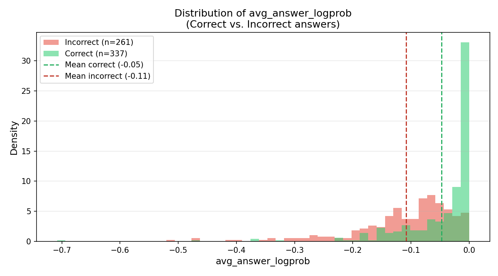
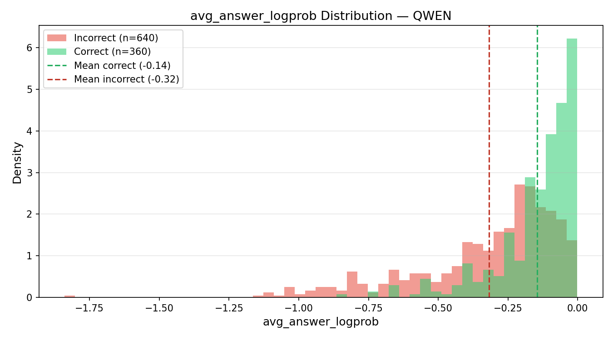
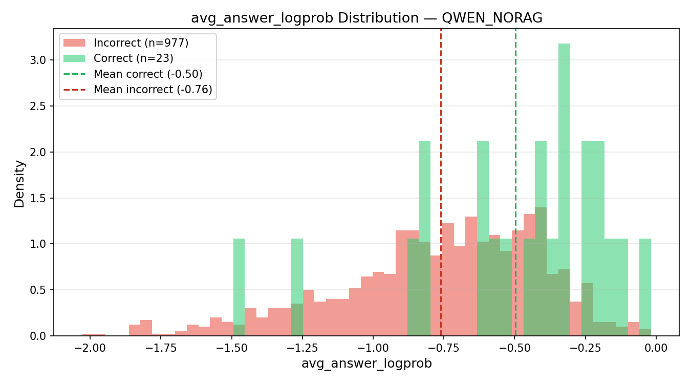

## Abstract

This project evaluates whether token-level generation probabilities can serve as reliable uncertainty signals in retrieval-augmented question answering systems. Using SQuAD and two open-source LLM families, we study correctness prediction, calibration, and selective answering.

## Objective

Determine whether average token log-probability predicts answer correctness across models and retrieval settings.

## Method

1. Build FAISS retrieval index from SQuAD contexts  
2. Retrieve relevant passages  
3. Generate answers with open-source LLMs  
4. Extract token log-probabilities  
5. Compare confidence against correctness labels

## Experiments

- Mistral-7B with RAG
- Qwen-0.5B with RAG
- Qwen-0.5B without RAG
- Cross-model AUROC comparison
- Calibration and risk-coverage evaluation

## Findings

- Confidence AUROC remained strong across settings
- RAG significantly improved QA accuracy
- Confidence ranking remained stable even without retrieval
- High-confidence filtering increased practical reliability

## Conclusion

Model-internal token likelihood is a useful and transferable uncertainty signal for QA systems. This supports lightweight white-box trust mechanisms for deployable RAG pipelines.
